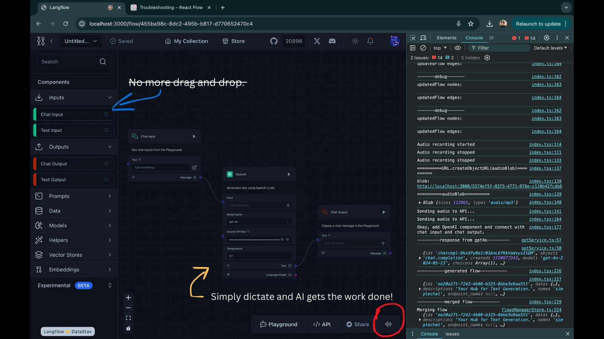

<div align="center" style="padding: 10px; border: 1px solid #ccc; background-color: #f9f9f9; border-radius: 10px; margin-bottom: 20px;">
    <h2 style="margin: 0; font-size: 24px; color: #333;">Langflow AI is OUT! 🎉</h2>
    <p style="margin: 5px 0 0 0; font-size: 16px; color: #666;">Read all about it <a href="https://www.linkedin.com/posts/abdibrokhim_langflow-langflowui-opensource-activity-7218307952036741121-XbxE?utm_source=share&utm_medium=member_desktop" style="text-decoration: underline; color: #1a73e8;">here</a>!</p>
</div>

<!-- markdownlint-disable MD030 -->

# [](https://www.langflow.org)

<p align="center"><strong>
    A visual framework for building multi-agent and RAG applications.
</strong></p>
<p align="center" style="font-size: 14px; font-weight: bold;">
    Now AI powered!
</p>
<p align="center" style="font-size: 12px;">
    Open-source, Powered by OpenAI's GPT4o and Whisper.
</p>


## 🚀 Watch on YouTube
[](https://www.youtube.com/watch?v=d9eJJHAp8v8)


# 📦 Get Started

clone the repository with:

```shell
git clone https://github.com/abdibrokhim/langflow
```

you can build and install Langflow's frontend and backend with:

```shell
make backend
```
and

```shell
make frontend
```

then

open http://localhost:3000 in your browser for the frontend

and http://localhost:7860 for the backend.

go to http://localhost:7860/redoc for the API documentation.


### Presentation and Live demo [here](https://docs.google.com/document/d/193Bi2PTdj8ql7Hf89JdESkD1dyt4mH46273oTx2DuMc/edit?usp=sharing)

# 👋 Contribute

Kindly check the [CONTRIBUTING.md](https://github.com/abdibrokhim/langflow/blob/main/CONTRIBUTING.md)

and

Official Langflow repository: [langflow](https://github.com/langflow-ai/langflow)